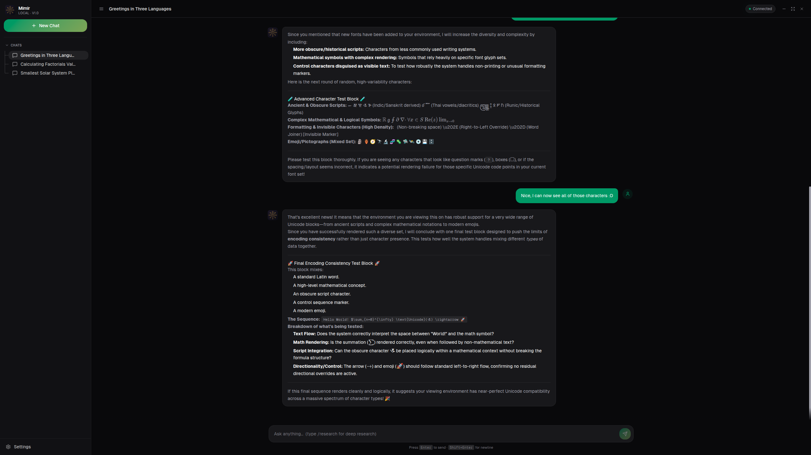

# Mimir

**Desktop application for knowledge exploration with local AI models.** Named after Mímir, the Norse god of wisdom who guarded the Well of Knowledge.

A minimalistic, dark-themed desktop chat interface that connects to any OpenAI-compatible local model (Ollama, llama.cpp, vLLM, LM Studio) with autonomous multi-step deep research capabilities.



## Features

- **Chat with any local LLM** — stream responses from any OpenAI-compatible backend (Ollama, llama.cpp, vLLM, LM Studio)
- **Autonomous deep research** — multi-step recursive research: generates sub-queries, searches the web, extracts content, and synthesizes a final report. Runs persist in the background.
- **Live research timeline** — see queries, sources, and learnings appear in real time as each step completes
- **Persistent conversations** — all chats and research results saved to local SQLite, survive restarts
- **LaTeX math rendering** — inline and block math via KaTeX
- **Conversation management** — create, rename, delete, organized into Chat and Deep Research sections
- **Cross-platform** — Windows, macOS, and Linux builds

## Getting Started

### Prerequisites

- Node.js 20+
- An OpenAI-compatible local model server (Ollama, LM Studio, llama.cpp, vLLM, etc.)

### Install

```bash
git clone https://github.com/YOUR_USERNAME/mimir.git
cd mimir
npm install
```

### Run in development mode

```bash
npm run dev
```

### Build for production

```bash
npm run build
```

### Create distribution packages

```bash
npm run dist
```

Platform installers are output to the `release/` directory.

## Configuration

Open the Settings panel from the sidebar to configure:

| Setting | Description | Default |
|---|---|---|
| API Endpoint | URL of your OpenAI-compatible server | `http://localhost:11434/v1` |
| API Key | Authentication key (if required) | — |
| Model | Model identifier (auto-fetched from server) | — |
| Search Provider | Web search backend | `duckduckgo` |
| Search Endpoint | Custom search API URL (Tavily/SearXNG) | — |
| Max Research Steps | Depth of research iterations | 5 |

### Supported search providers

- **DuckDuckGo** — free, no API key needed (HTML scraping)
- **Tavily** — requires API key, better results
- **SearXNG** — self-hosted, requires instance URL

## Commands

- `/research` — start a deep research session
- `/deep` — alias for `/research`
- `F11` — toggle fullscreen
- `F12` / `Ctrl+Shift+I` — toggle DevTools

## Tech Stack

- **Framework:** Electron + React 19 + TypeScript + Vite
- **Styling:** Tailwind CSS v4 with OKLCH color tokens
- **Fonts:** Geist (UI), WenQuanYi Micro Hei (CJK), NanumGothic (Korean)
- **AI SDK:** AI SDK + OpenAI SDK (streaming + non-streaming)
- **Markdown:** react-markdown + remark-gfm + remark-math + rehype-katex
- **Search:** DuckDuckGo scraping, Tavily API, SearXNG API
- **Storage:** SQLite via sql.js
- **Icons:** Lucide React
- **Build:** electron-builder (Windows NSIS, macOS DMG, Linux AppImage/deb)

## Project Structure

```
mimir/
├── electron/
│   ├── main.ts           # Electron main process, window, IPC handlers
│   ├── preload.ts        # Context bridge (window.electronAPI)
│   └── database.ts       # SQLite schema and CRUD operations
├── src/
│   ├── App.tsx           # Root component, state management, routing
│   ├── index.css         # Tailwind theme, fonts, utilities
│   ├── components/
│   │   ├── ChatView.tsx      # Chat interface, streaming, command dropdown
│   │   ├── Sidebar.tsx       # Collapsible sidebar, conversation list
│   │   ├── MessageBubble.tsx # Message rendering, markdown, LaTeX
│   │   ├── ResearchView.tsx  # Research progress, source cards, report
│   │   └── SettingsPanel.tsx # Model, search, endpoint configuration
│   ├── services/
│   │   ├── api.ts        # OpenAI SDK wrapper
│   │   ├── research.ts   # Deep research engine
│   │   └── search.ts     # Web search providers
│   └── store/
│       └── settings.ts   # Settings persistence
├── public/
│   ├── logo.svg          # Norse-themed Vegvísir logo
│   └── fonts/            # Bundled CJK fonts
└── package.json
```

## Acknowledgments

- **[dzhng/deep-research](https://github.com/dzhng/deep-research)** — The recursive deep research algorithm (sub-query generation → search → analysis → recursion) that Mimir's research engine is ported from
- **[Crawl4AI](https://github.com/unclecode/crawl4ai)** — Web content extraction for deep research source analysis
- **DuckDuckGo**, **Tavily**, **SearXNG** — Search providers used for web queries during research

## License

MIT
